I build Python services that run unattended: exchange pipelines that survive disconnects,
async APIs that respect other people's limits, and LLM systems measured rather than assumed.

Most of the work is commercial and private — trading infrastructure, data platforms and
internal AI services. Clients come back for a second contract. That is the metric I care about.

## What I build

**Market data.** WebSocket collectors write into PostgreSQL / TimescaleDB. Order books are
rebuilt from snapshot and deltas, and gaps are repaired on reconnect.

**Exchanges.** One execution interface behind 11 venues. Each venue gets its own client and
error taxonomy, under shared retry and stream watchdogs.

**Backend.** FastAPI and async SQLAlchemy, SSE with a polling fallback, background workers,
idempotent pipelines.

**AI.** RAG over internal knowledge bases, function calling with structured output, model
routing with fallbacks, and cost accounting per user.

## Two problems that weren't obvious

**Billing that counted silence.**

A platform charged per conversation, and its four-second window started the moment a message
was *fetched* — not when it was answered. So the obvious `poll → llm → reply` loop kept
donating paid conversations to the platform's own auto-responder.

I split polling from processing, and turned the uncovered time into a metric.

**An API with no counter and no cursor.**

Nothing to page by, and an aggressive `429` on top. I wrote a token-bucket client that backs
off honestly on `403`, and reports live progress over SSE — falling back to polling wherever
SSE is blocked.

## Selected work

<table>
<tbody>
  <tr>
    <td width="50%"></td>
    <td width="50%"></td>
  </tr>
  <tr>
    <td width="50%"></td>
    <td width="50%"></td>
  </tr>
  <tr>
    <td width="50%"></td>
    <td width="50%"></td>
  </tr>
  <tr>
    <td width="50%"></td>
    <td width="50%"></td>
  </tr>
</tbody>
</table>

· <a href="https://github.com/web3daemon?tab=repositories">All repositories</a>

## Contact

Open to backend and AI engineering work — contract or full-time.
